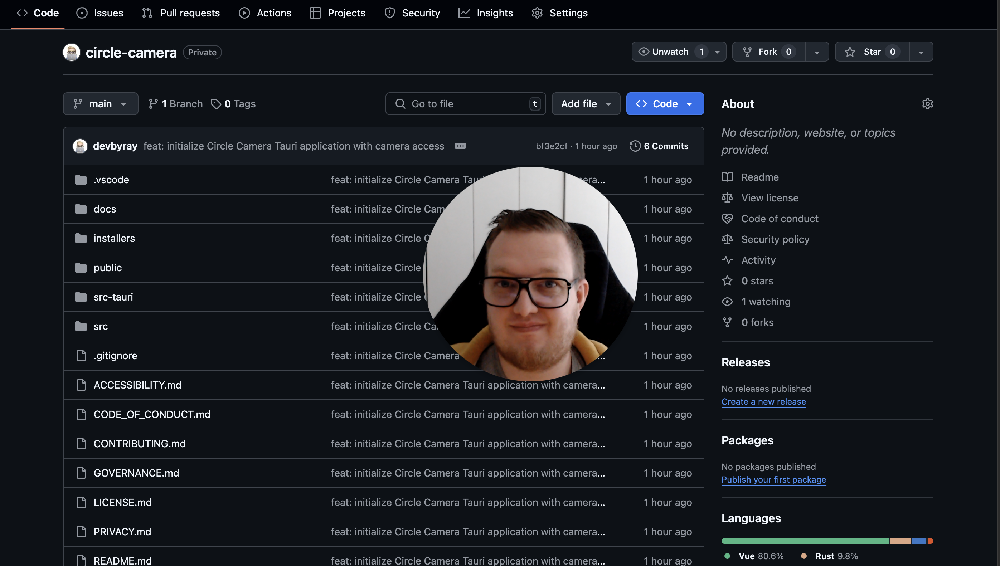
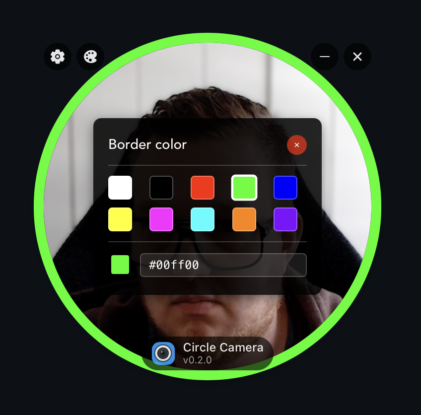
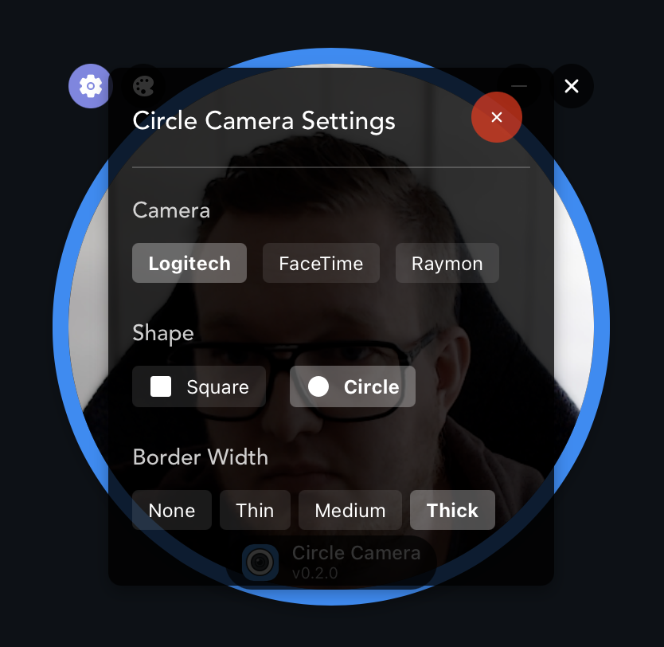

# Circle Camera

<p align="center">
  
</p>

<p align="center">
  A sleek, minimalist webcam app that displays your camera feed in a perfect circle.
</p>



<div align="center">


</div>

---


<p align="center">
  <a href="#features">Features</a> •
  <a href="#installation">Installation</a> •
  <a href="#usage">Usage</a> •
  <a href="#development">Development</a> •
  <a href="#building">Building</a> •
  <a href="#license">License</a>
</p>

## Features

✨ **Customizable Shape** - Display your webcam feed in a perfect circle or square, based on your preference

🔍 **Resizable** - Easily adjust the size using buttons or keyboard shortcuts

🖱️ **Draggable** - Position the camera anywhere on your screen

🎥 **Camera Selection** - Switch between multiple cameras if available

🎨 **Border Customization** - Adjust border thickness and color to match your style

🔄 **Always on Top** - Stay visible over other applications

🎮 **Minimal UI** - Controls only appear when you hover over the camera

🖼️ **Transparent Background** - Seamlessly blend with any desktop

🔢 **Version Display** - Always know which version you're using

## Installation
Currently we only support MacOS, Windows will come soon.

### macOS

1. Download the latest DMG installer from the [installers](/installers) directory
2. Open the DMG file
3. Drag the Circle Camera app to your Applications folder
4. Open the app from your Applications folder or Launchpad

## Usage

### Basic Controls

- **Drag**: Click and drag anywhere on the camera display to move it
- **Resize**: Hover over the camera and use the + and - buttons to resize, or use keyboard shortcuts (Arrow Up/Down)
- **Shape Toggle**: Switch between circle and square camera views from the settings menu
- **Border Customization**: Adjust border thickness and select any color using the color picker
- **Camera Selection**: Switch between cameras using the camera dropdown menu
- **Close**: Hover over the camera and click the X button to close the app
- **Version**: The current version is displayed at the bottom of the settings menu

### Tips

- Position the camera in a corner of your screen during presentations
- Adjust the size based on the importance of your camera feed
- For screen recordings, position the app before starting your recording

## Development

### Prerequisites

- Node.js (v16 or later)
- pnpm
- Rust and Cargo

#### MacOS
- brew install llvm

#### MacOs build Windows app
Check the Tauri guide for creating the [Windows app on MacOS](https://v2.tauri.app/distribute/windows-installer/#experimental-build-windows-apps-on-linux-and-macos).

#### Windows
- choco install llvm

### Setup

1. Clone the repository
```bash
git clone https://github.com/yourusername/circle-camera.git
cd circle-camera
```

2. Install dependencies
```bash
pnpm install
```

3. Start the development server
```bash
pnpm tauri dev
```

## Building

### Building for macOS

```bash
pnpm build:installer
```

This will create a DMG installer in the `installers` directory.

### Customizing the App Icon

1. Replace the `public/icon.svg` file with your own SVG icon
2. Generate the app icons:
```bash
pnpm icons
```
3. Rebuild the app

## License

[EUTPL](/LICENSE.md)

---

<p align="center">
  Made with ❤️ using <a href="https://tauri.app">Tauri</a>, <a href="https://vuejs.org">Vue</a>, and <a href="https://www.rust-lang.org">Rust</a>
</p>